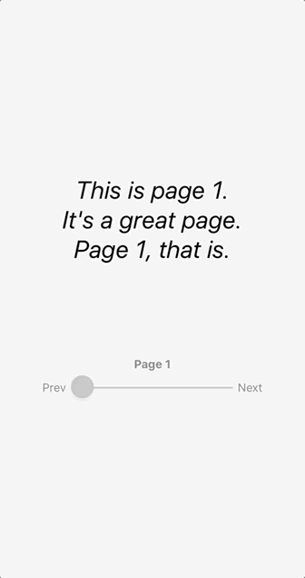
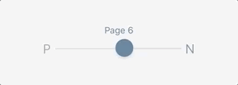

## A React Native component that renders a slider pagination.

By installing this component you can paginate like this



You can customize color and style like so



## Installation
---
Install `react-native-slider-pagination` with npm:

`$ npm install react-native-slider-pagination --save`

The easiest way to get going

```
import { SliderPaginationView } from 'react-native-slider-pagination';

//Other code here

render() {
    const pageCallBack = (pageNum) => {
        setPage(pageNum);
    };
    <SliderPaginationView
        pageCount={10}
        onPageChange={pageCallBack}
    />
}
```

Since @react-native-community/slider, a dependency, is incompatible with Expo, you will need to set up the React Native CLI environment. More about that [here](https://facebook.github.io/react-native/docs/getting-started). 

## Props:    
[pageCount](#pageCount)   
[previousLabel](#previousLabel)   
[nextLabel](#nextLabel)   
[onPageChange](#onPageChange)   
[initialPage](#initialPage)   
[disableInitialCallback](#disableInitialCallback)   
[containerClassName](#containerClassName)    
[previousClassName](#previousClassName)    
[nextClassName](#nextClassName)    
[previousLinkClassName](#previousLinkClassName)    
[nextLinkClassName](#nextLinkClassName)   
[sliderClassName](#sliderClassName)   
[disabledPageLabel](#disabledPageLabel)   
[sliderStyle](#sliderStyle)   
[pageLabelSelectedStyle](#pageLabelSelectedStyle)   
[pageLabelUnselectedStyle](#pageLabelUnselectedStyle)
[minimumTrackTintColor](#minimumTrackTintColor)
[maximumTrackTintColor](#maximumTrackTintColor)
[thumbTintColor](#thumbTintColor)

---
**<a name="pageCount"></a>`pageCount`**   
Number of pages that will be displayed on the slider.   

| Type             | Required  |
|:-------------:   | :-----:   |
| number | Yes       |
    

---
**<a name="previousLabel"></a>`previousLabel`**   
Fragment that will be used as the previous page label.

| Type             | Required  |
|:-------------:   | :-----:   |
| node | No       |

---
**<a name="nextLabel"></a>`nextLabel`**   
Fragment that will be used as the next page label.

| Type             | Required  |
|:-------------:   | :-----:   |
| node | No       |

---
**<a name="onPageChange"></a>`onPageChange`**   
Callback that is called when a page is selected.
The selected page number is passed as a parameter.

| Type             | Required  |
|:-------------:   | :-----:   |
| func | No       |

---
**<a name="initialPage"></a>`initialPage`**   
Initial page that the slider should be rendered on.

| Type             | Required  |
|:-------------:   | :-----:   |
| number | No       |

---
**<a name="disableInitialCallback"></a>`disableInitialCallback`**   
Boolean that can disable onPageChange when the component is rendered.

| Type             | Required  |
|:-------------:   | :-----:   |
| bool | No       |

---
**<a name="containerClassName"></a>`containerClassName`**   
Classname of the container of the component.

| Type             | Required  |
|:-------------:   | :-----:   |
| string | No       |

---
**<a name="previousClassName"></a>`previousClassName`**   
Classname of the view that contains the TouchableOpacity component of the previous label.

| Type             | Required  |
|:-------------:   | :-----:   |
| string | No       |

---
**<a name="nextClassName"></a>`nextClassName`**   
Classname of the view that contains the TouchableOpacity component of the next label.

| Type             | Required  |
|:-------------:   | :-----:   |
| string | No       |

---
**<a name="previousLinkClassName"></a>`previousLinkClassName`**    
Classname of the TouchableOpacity component that contains the previous label.

| Type             | Required  |
|:-------------:   | :-----:   |
| string | No       |

---
**<a name="nextLinkClassName"></a>`nextLinkClassName`**   
Classname of the TouchableOpacity component that contains the next label.

| Type             | Required  |
|:-------------:   | :-----:   |
| string | No       |

---
**<a name="sliderClassName"></a>`sliderClassName`**    
Classname of the Slider component.

| Type             | Required  |
|:-------------:   | :-----:   |
| string | No       |

---
**<a name="disabledPageLabel"></a>`disabledPageLabel`**   
Boolean that can disable the Page label above the slider pagination.

| Type             | Required  |
|:-------------:   | :-----:   |
| bool | No       |

---
**<a name="sliderStyle"></a>`sliderStyle`**    
Style object for the Slider.

| Type             | Required  |
|:-------------:   | :-----:   |
| object | No       |

---
**<a name="pageLabelSelectedStyle"></a>`pageLabelSelectedStyle`**    
Style object of the page label when it shows the current page.

| Type             | Required  |
|:-------------:   | :-----:   |
| object | No       |

---
**<a name="pageLabelUnselectedStyle"></a>`pageLabelUnselectedStyle`**    
Style object of the page label when it shows pages other than the current page.

| Type             | Required  |
|:-------------:   | :-----:   |
| object | No       |

---
**<a name="minimumTrackTintColor"></a>`minimumTrackTintColor`** 

Color of the track left of the thumb on the slider.

| Type             | Required  |
|:-------------:   | :-----:   |
| string | No       |
     
---
**<a name="maximumTrackTintColor"></a>`maximumTrackTintColor`** 

Color of the track right of the thumb on the slider.

| Type             | Required  |
|:-------------:   | :-----:   |
| string | No       |
    
---
**<a name="thumbTintColor"></a>`thumbTintColor`** 

Color of the thumb on the slider.

| Type             | Required  |
|:-------------:   | :-----:   |
| string | No       |   
